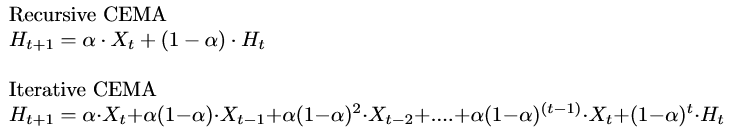

# EMA-mess-up

## Introduction
Introducing linear behaviour in-between training samples to reduce generalization error was the main objective of <a href = 'https://arxiv.org/pdf/1710.09412.pdf'>Mixup <a/> augmentation/regularization. Mixup inturn reduces "undesirable oscillations when predicting outside the training examples". The coefficient of the linear combination is sampled from beta distribution(Convex combination to be precise). 

In this repository inspired by mixup, I introduce exponential moving average while sampling training samples, in other words samples are mixed and are exponentially weighed down as training progresses.I call this method <b>messup</b>.

## Algorithm
Concretely the algorithm is as follows,

To explain the algorithm, EMA in general weighs down all the training points in any problem exponentially as time progresses. In other words past examples are weighed down exponentially and the most recent training example is assigned with a higher weight. This weight is the smoothing constant.

Like EMA, Messup has a smoothing constant alpha and an extra hyperparameter called <b>Reset Cycle (C)</b>. All <b> C </b> does is reset the weights or reset exponential dependency between training samples at the value time step <b> C </b>. To understand better Messup acts like an EMA when the value   <b>C</b> = int(Number of training samples/Batch size) for an epoch. So if the value of <b> C = 30 </b>, this means for every 30 steps in an epoch, all the encontered samples' weights are reset.(weight here refers to the smoothing constant!) 

Algorithm <b> REMA (Reset Exponential Moving Average) </b> is called when the current step is divisible by <b> C </b>.

Algorithm <b> CEMA (Compute Exponential Moving Average) </b> is called till the current step is not divisble by <b> C </b>. If CEMA doesn't make sense as an algorithm, all its doing is computing the equation iteratively than recursively.

## What is Messup doing?

Messup introduces linear behaviour between training samples like Mixup. Mixup converges to ERM strategy when the parameters of beta distribution tends to zero, i.e. the coefficient λ ~ beta(0,0) = 1. Like Mixup, Messup's smoothing constant can also be made to 1. Thereby making network to use ERM strategy.

## Can it compete with Mixup?

Mixup constructs virtual samples in a step itself. Suppose X is a training sample and λ is the coefficent. The Virtual sample is  
λ\*X + (1-λ)\*shuffle(X). But Messup does it across steps since EMA comes into play. So it encounters the same sample from previous step but with reduced weight. This in an intuitive sense lags behind mixup because of this reason. So I never ran the comparision because Mixup would naturally outperform Messup. Although since this is not a time series problem, I think we can shuffle the previously encountered data between steps and increase the robustness.

## Prerequisites

- PyTorch > 1.4

## Experiment

To run Messup I use Cifar-10 on ResNet with only Identity skips from <a href = "https://github.com/kuangliu/pytorch-cifar">this repository</a>(PreActResnet18) 

## Setup

batch-size - 128
optimizer - Adam
step-size - 0.001

## Results

| Strategy| Model   | smoothing constant (α) | Reset Cycle (C) | Classification Error  |
|-------- | ------- | ---------- | ---------  | ---------  |
|ERM| ResNet-18 | NA | NA |  7.69 |
|Messup| ResNet-18 | 0.7 | 5 |  6.70 |
|Messup| ResNet-18| 0.7| 30 | 6.26 |
|Messup| ResNet-18| 0.7| 80 | 6.09 |

